[toc]
# 使用vscode

# 使用vue-element-admin前端框架
参考文档：
https://panjiachen.github.io/vue-element-admin-site/zh/guide/

# 启动项目
## 下载项目 & 编译启动
git clone http://gitlab.joinboom.net/restatistics/vue-element-admin.git
cd vue-element-admin
npm install
npm run dev

# 代码梳理
## 登陆、菜单、角色
### 登陆接口
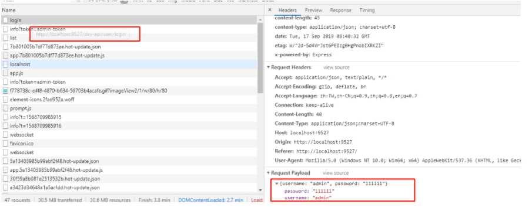
响应是{"code":20000,"data":{"token":"admin-token"}}
### 获取用户信息接口
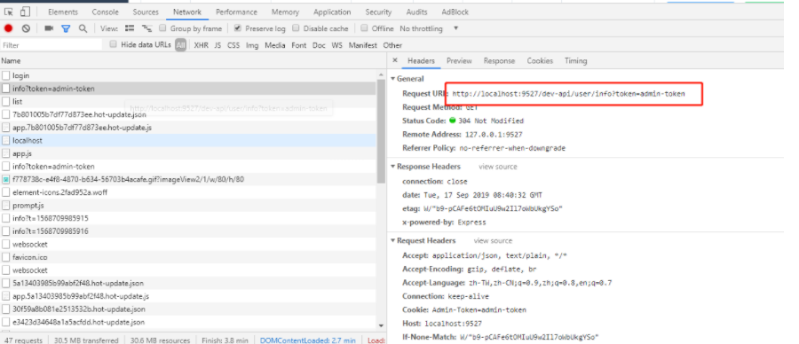
响应是{"code":20000,"data":{"roles":["admin"],"introduction":"I am a super administrator","avatar":"https://wpimg.wallstcn.com/f778738c-e4f8-4870-b634-56703b4acafe.gif","name":"Super Admin"}}
### 渲染菜单的流程
**提出问题：**
在角色管理的页面上，可以编辑角色和菜单的关系，即勾选可访问的菜单，这个是要动态提交到后台去的。所以问题是，permission.js中的代码，是否只是路由的添加，不是页面层上是否可见的控制？
**解答：**
在src\layout\components\Sidebar\index.vue里有关sidebar的遍历，其数据是permission_routes，这个数据是从
state.permission.routes中获取到的；
state.permission.routes的设置，是在src\store\modules\permission.js里面设置的，代码如下
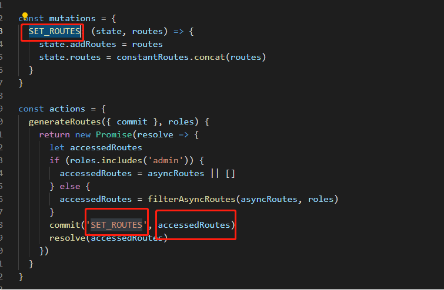
**结论：**
1. 如果要动态的从后台获取菜单，那么只要在src\store\modules\permission.js的generateRoutes方法中改变获取accessedRoutes的方式，比如通过axios从后台接口获取
2. 目前项目代码中，可见路由的动态加载和菜单的展示，都是调用的src\store\modules\permission.js里的方法，所以如果不是动态加载的菜单，直接在router.js里增减菜单和进行角色复制即可
### 所有菜单配置在src\router\index.js
### 动态菜单配置（动态路由：根据角色）src\permission.js
大致的思路：
1. 在src\router\index.js中定义了constantRoutes静态路由和asyncRoutes动态加载路由（这个里面是全部的菜单）
2. 会在src\permission.js中
通过const accessRoutes = store.dispatch('permission/generateRoutes', roles)动态添加路由
并通过router.addRoutes(accessRoutes)动态加载路由
3. 在src\store\modules\permission.js的generateRoutes方法中通过角色来获取并设置可以访问的路由
```
const actions = {
  generateRoutes({ commit }, roles) {
    return new Promise(resolve => {
      let accessedRoutes
      if (roles.includes('admin')) {
        accessedRoutes = asyncRoutes || []
      } else {
        accessedRoutes = filterAsyncRoutes(asyncRoutes, roles)
      }
      commit('SET_ROUTES', accessedRoutes)
      resolve(accessedRoutes)
    })
  }
}
```
4. 继续跟代码，发现进入到hasPermission方法，该方法是获取了@/router/router.js中定义的菜单中角色名来判断是否有权限访问的
5. 所以只需要在@/router/router.js里面的菜单中，定义可访问的角色名称即可
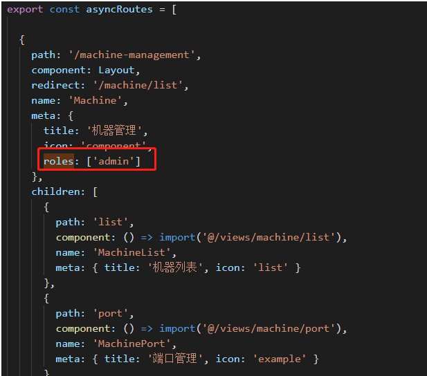


### 打开角色菜单
角色列表页
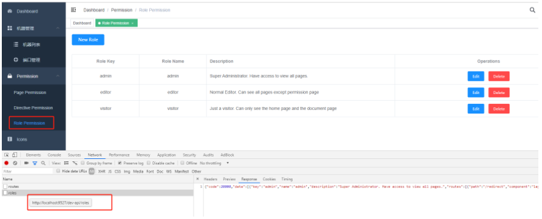
在打开“角色”页面的时候，就已经调用了/roles接口，此接口是mock的，返回了admin、editor、visitor3个角色的对应routes，目前这些routes都是在mock\role\routes.js里面写的
### 更新角色，目前都是mock，没有实际逻辑
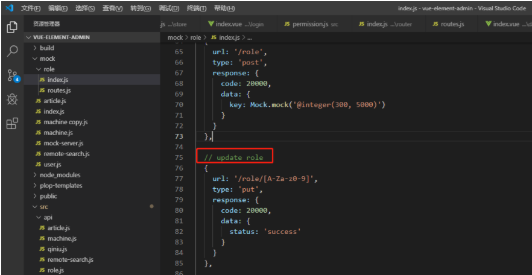

## axios请求，proxy代理
### 整体的概览
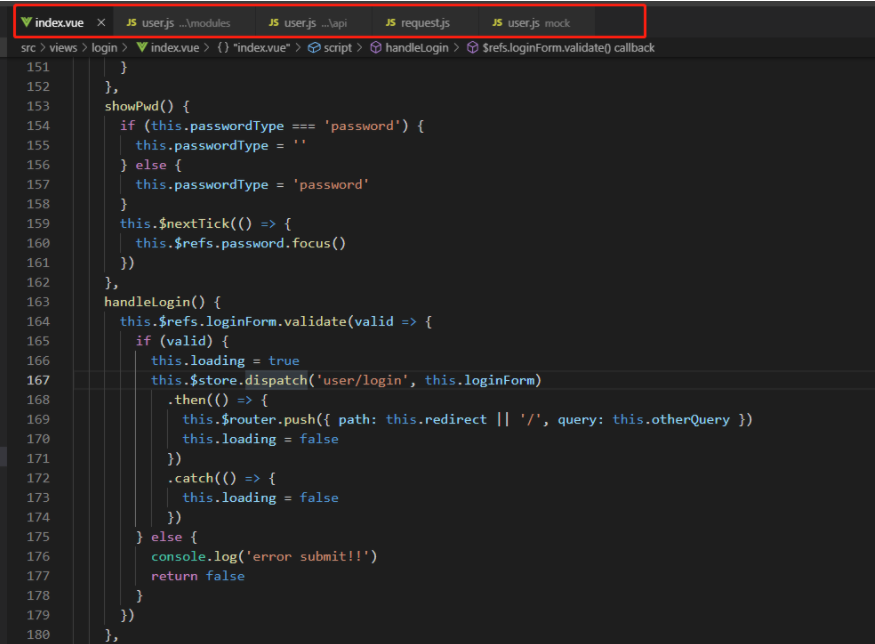
**流程说明**
1. index.vue是一个组件
2. 组件中通过this.$store.dispatch来请求登陆
3. store中，调用api模块中的接口
4. api模块中的接口，使用了@/utils/request.js封装的axios方法，主要做了前置拦截，在请求中附带token信息
5. 本项目为了方便开发，引入了mock，方法是请求到了mock模块的user.js中，返回mock数据

## mock
### 如何新增一个mock接口？
a. 在mock模块中新增一个api文件，并写好要mock的接口地址和响应的数据，如下图
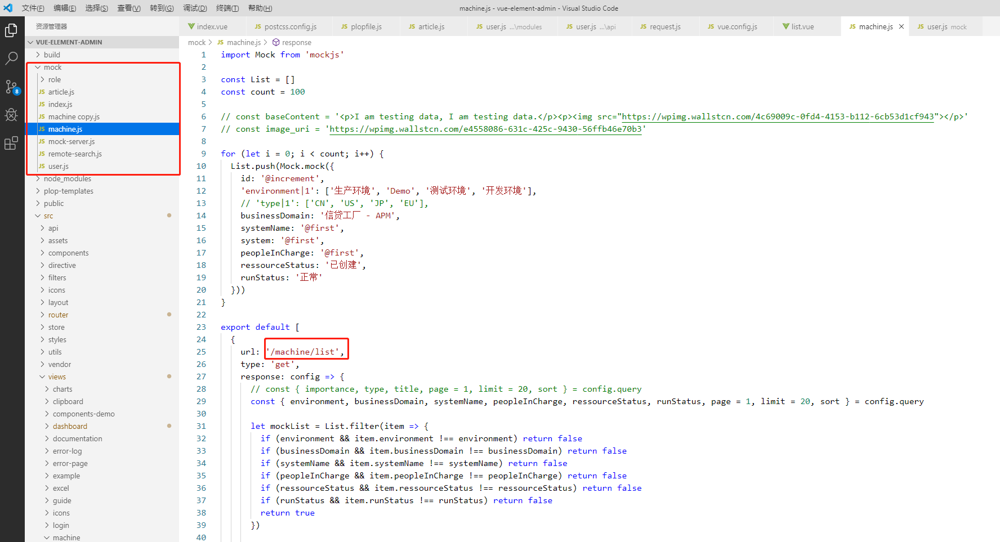
b. 在@src/api/machine.js中，编写接口调用
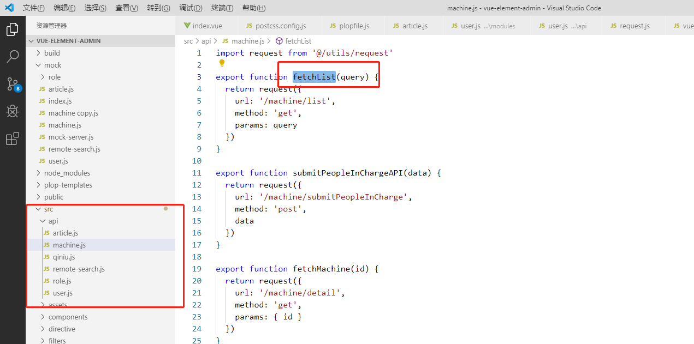
c. 在组件中引用api接口，即可调用并获取mock数据
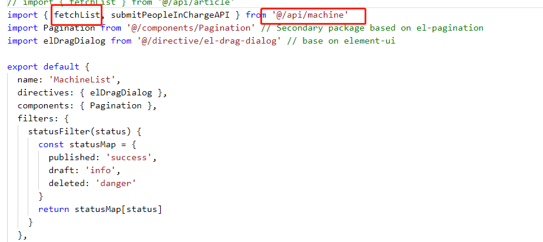
### 如何取消mock？
因为是前后端分离的项目，所以在后台开发接口的时候，前端需要有mock接口的能力，此项目中，只需要把@vue.config.js中的proxy改为后端地址，即可将请求转发到后台，如下图
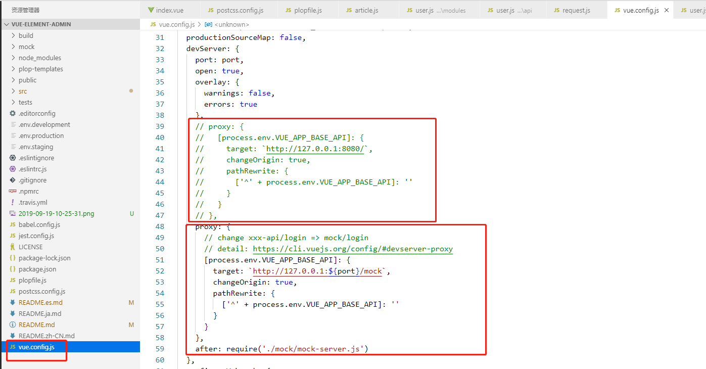


# vue的其他知识点
## vuex
https://www.cnblogs.com/chinabin1993/p/9848720.html
## 手摸手，带你用vue撸后台 系列
https://juejin.im/post/59097cd7a22b9d0065fb61d2
## 使用vue-element-admin前端框架（此项目的参考手册）
参考文档：
https://panjiachen.github.io/vue-element-admin-site/zh/guide/