<!-- TOC -->

- [1. 中英文对照](#1-中英文对照)
    - [1.1. 各种概念的全量、统一定义](#11-各种概念的全量统一定义)
        - [1.1.1. ODS、EDW、DWD  DW、ST  主数据 (MDM)、CIF（企业级统一视图）   ODS+DM+AS](#111-odsedwdwd--dwst--主数据-mdmcif企业级统一视图---odsdmas)
- [2. 数仓概念](#2-数仓概念)
    - [2.1. 说说数仓(1) - 什么是数仓](#21-说说数仓1---什么是数仓)
    - [2.2. 说说数仓(2) - 传统数仓与互联网数仓](#22-说说数仓2---传统数仓与互联网数仓)
        - [2.2.1. 用户群体](#221-用户群体)
        - [2.2.2. 数据平台时间发展史](#222-数据平台时间发展史)
        - [2.2.3. Inmon和Kimball数仓模型的对比](#223-inmon和kimball数仓模型的对比)
            - [2.2.3.1. 特征对比](#2231-特征对比)
            - [2.2.3.2. 特性](#2232-特性)
            - [2.2.3.3. 优劣比较](#2233-优劣比较)
            - [2.2.3.4. 具体例子](#2234-具体例子)
                - [2.2.3.4.1. 数据](#22341-数据)
                - [2.2.3.4.2. 对比](#22342-对比)
                - [2.2.3.4.3. Inmon 模式：](#22343-inmon-模式)
                - [2.2.3.4.4. Kimball 模式：](#22344-kimball-模式)
                - [2.2.3.4.5. 总结](#22345-总结)
        - [2.2.4. （可略过）新一代架构 OPDM 操作型数据集市 (仓库)](#224-可略过新一代架构-opdm-操作型数据集市-仓库)
        - [2.2.5. 数据模型（概念模型、逻辑模型、物理模型）](#225-数据模型概念模型逻辑模型物理模型)
        - [2.2.6. 数据源差异（非互联网、互联网、移动互联网）](#226-数据源差异非互联网互联网移动互联网)
        - [2.2.7. （了解）约 2010-2012 年的平台结构](#227-了解约-2010-2012-年的平台结构)
        - [2.2.8. （了解）约 2012-2013 年的平台结构](#228-了解约-2012-2013-年的平台结构)
        - [2.2.9. 事实表、维度举例](#229-事实表维度举例)
        - [2.2.10. 雪花模型&星型模型](#2210-雪花模型星型模型)
            - [2.2.10.1. 先举个例子，淘宝商品的雪花模型](#22101-先举个例子淘宝商品的雪花模型)
            - [2.2.10.2. 概述](#22102-概述)
                - [2.2.10.2.1. 销售数据仓库中的星型模型](#221021-销售数据仓库中的星型模型)
                - [2.2.10.2.2. 销售数据仓库中的雪花模型](#221022-销售数据仓库中的雪花模型)
            - [2.2.10.3. 使用选择](#22103-使用选择)
- [3. 数仓技术实现](#3-数仓技术实现)
    - [3.1. 元数据管理要义](#31-元数据管理要义)
    - [3.2. 分层逻辑架构](#32-分层逻辑架构)
    - [3.3. 典型的数据仓库架构分层](#33-典型的数据仓库架构分层)
    - [3.4. 阿里数仓分层](#34-阿里数仓分层)
    - [3.5. 阿里模型架构图 （大数据之路9.3）](#35-阿里模型架构图-大数据之路93)
- [4. 数据管理篇](#4-数据管理篇)
    - [4.1. 元数据](#41-元数据)
        - [4.1.1. 元数据定义](#411-元数据定义)
        - [4.1.2. 元数据价值](#412-元数据价值)
        - [4.1.3. 统一元数据体系建设思路图](#413-统一元数据体系建设思路图)
- [5. 工具](#5-工具)
- [6. 逻辑架构（从头开始再次梳理）](#6-逻辑架构从头开始再次梳理)

<!-- /TOC -->
# 1. 中英文对照
## 1.1. 各种概念的全量、统一定义
### 1.1.1. ODS、EDW、DWD  DW、ST  主数据 (MDM)、CIF（企业级统一视图）   ODS+DM+AS
+ ST：Staging？数仓中的预处理层，存储每天的增量数据
+ ODS：Operation Data Store，操作数据存储；原始数据，与业务仓库保持同步
+ DWD：Data Warehouse Detail，数据仓库明细；数据明细详情，去除空值，脏数据，超过极限范围的数据
+ DWS：Data Warehose Summary，数据仓库服务；宽表，服务层数据，轻度聚合对DWD，比如留存-转化-GMV-复购率-日活等
+ ADS：Application Data Store，应用数据存储；可理解为出的报表结果等
+ DIM：dimension，维度；例如，时间维度，省市区地址维度，学历维度，这个是在数仓各层都共享使用的

+ DM：Data Mart，数据集市：狭义ADS
+ DW ：data warehouse 翻译成数据仓库
+ EDW：Enterprise Data Warehose，企业级数据仓库
+ EDS: Enterprise Data Store，企业级数据存储（企业数仓）
+ CIF：Corporation Integration Factory，企业级统一视图  
+ OLTP：on-line transaction processing，在线事务处理
+ OLAP：On-Line Analytical Processing，在线分析处理

# 2. 数仓概念
概念的引入：首先，前面几节的目的，是集大家之所长，充分考虑规划的合理性并进行适当裁剪，形成适合公司规模与业务的数仓模型  
+ 什么是数仓？
+ 数仓的几个特点是什么？
+ 什么是OLAP？什么是OLTP？区别是什么？
+ 拉链表是什么？怎么实现拉链表？
+ 同步又哪几种方式？
+ 为什么要做增量？怎么做增量？
+ 什么是ETL？

## 2.1. 说说数仓(1) - 什么是数仓
`数据仓库（DataWarehouse），一般缩写成DW、DWH。数据仓库是一个面向主题的（Subject Oriented）、集成的（Integrate）、相对稳定的（Non-Volatile）、反映历史变化（Time Variant）的数据集合，用于支持管理决策。`
&emsp;从字面上来看，数据仓库就是一个存放数据的仓库，它里面存放了各种各样的数据，而这些数据需要按照一些结构、规则来组织和存放。这里我们会遇到一个问题就是同样是存放数据的仓库，那数据库和数据仓库是一样的吗？  
**数据库 VS 数据仓库**  
数据库就是我们常用的关系型数据库（MySQL、Oracle、PostgreSQL...），还有什么非关系型数据库，它主要存放业务数据，那数据仓库又有些什么数据呢？
说到他们的区别，我们一般会提到OLTP和OLAP，
OLTP：on-line transaction processing，联机事务处理，主要是业务数据，需要考虑高并发、考虑事务
OLAP：On-Line Analytical Processing，联机分析处理，重点主要是面向分析，会产生大量的查询，一般很少涉及增删改

**大数据**  
&emsp;数据仓库其实是一套体系，他不是一门什么技术，而是整合了很多已有的技术，来更好地组织和管理数据。
&emsp;传统数仓的话，主要是基于关系型数据库，后面还有一些分布式的数据库像Greenplum，还有很多公司会提供基于硬件的一整套解决方案。在传统数仓开发时，由于硬件的性能有限，所以有很多的要求，而随着硬件价格的下降、云服务器的广泛使用，还有大数据技术的成熟发展，数仓的很多场景都变了，有些规则都不需要去严格遵守了，这样也可以省下很多的成本。  
**前世今生1**  
&emsp;以前很多招聘ETL工程师的，这些岗位主要是基于某一个厂商的工具入手，熟练使用该工具就行了，比如Datastage，以前玩儿过一个报表工具叫Cognos，IBM的一个工具，也有很多岗位是招Cognos工程师的，后来不玩儿这个。
&emsp;传统行业喜欢叫数仓，互联网公司喜欢叫数据平台（包含数仓，偏向建模）。我记得数仓这一概念也是从传统行业发起的，它涉及的资料其实都是好多年之前的了，最近也找过，但是没什么新的内容，概念还是那些概念，只是技术更新迭代了，所以也导致很多的观点不太适用了。
&emsp;就目前互联网数仓这一岗位，感觉更加偏重业务+建模思想，面试不太好考察这些内容的，去年招聘的时候，就是问些基本问题，聊聊以往主要的工作内容，还会问问SQL题，真的想了解下建模的话，还是找本书借鉴性的看看，还是很有益处的。

## 2.2. 说说数仓(2) - 传统数仓与互联网数仓
**前世今生2**  
本节内容，借鉴下面的几篇文章，建议直接看原文，本节内容只会摘抄部分关键要素
[我所经历的大数据平台发展史（一）：非互联网时代 • 上篇](https://www.infoq.cn/article/the-development-history-of-big-data-platform/)
[我所经历的大数据平台发展史（二）：非互联网时代 • 下篇](https://www.infoq.cn/article/the-development-history-of-big-data-platfor2-part01/)
[我所经历的大数据平台发展史（三）：互联网时代 • 上篇](https://www.infoq.cn/article/the-development-history-of-big-data-platform-paet02/)
[我所经历的大数据平台发展史（四）：互联网时代 • 下篇](https://www.infoq.cn/article/the-development-history-of-big-data-platform-internet-age/)

### 2.2.1. 用户群体
+ 传统企业数据平台用户群

   + 企业的 boss、运营的需求主要是依赖于报表、商业智能团队的数据分析师去各种分析与挖掘探索；
   + 支撑这些人是 ETL 开发工程师、数据模型建模、数据架构师、报表设计人员 ，同时这些角色又是数据平台数据建设与使用方。
   + 数据平台的技术框架与工具实现主要有技术架构师、JAVA 开发等。
   + 用户面对是结构化生产系统数据源。
   **可以看出`传统企业数据平台用户群`的工作模式中，只有ETL开发工程师、模型架构师、研发架构师、程序员承担对`数据平台`的建设和使用**
+ 互联网第一阶段数据平台用户群

  + 企业各个主要角色都是数据平台用户。
  + 各类数据产品经理（偏业务数据产品、偏工具平台数据产品）推进数据平台的建设。
  + 分析师参与数据平台直接建设比重增加。
  + 数据开发、数据模型角色都是数据平台的建设者与使用者（备注：相对与传统数据平台的数据开发来说，逐渐忽略了数据质量的关注度，数据模型设计角色逐渐被弱化）。
  + 用户面对是数据源多样化，比如日志、生产数据库的数据、视频、音频等非结构化数据。
  + 原有 ETL 中部分数据转换功能逐渐前置化，放到业务系统端进行（备注：部分原有在 ETL 阶段需要数据标准化一些过程前置在业务系统数据产生阶段进行，比如 Log 日志。 移动互联网的日志标准化。
+ 互联网第二阶段数据平台用户群

   + 互联网企业中员工年龄比非互联网企业的要年轻、受教育程度、对计算机的焦虑程度明显比传统企业要低、还偶遇其它各方面的缘故，导致了数据平台**所面对用户群体与非互联网数据平台有所差异化**；
   + 互联网数据平台的使用与建设方是来自各方面的人，数据平台又是技术、数据产品推进建设的。
   + 分析师参与数据平台直接建设比重增加。
   + 原有的数据仓库开发与模型架构师的职能也从建设平台转为服务与咨询.
   + 用户面对是数据源多样化，比如日志、生产数据库的数据、视频、音频等非结构化数据 。
   **从上述的描述中可以看出：互联网数据平台用户群，ETL开发工程师、模型架构师不再直接对上游负责，而是转为培训、咨询、解决方案，这就要求业务分析师、数据PD、数据产品PD要能直接操作数据平台，而这就要求数据平台有足够的工具支撑**

**什么是PD？**  
PD：直译为产品设计师，也可能叫产品规划师、需求分析师。PD侧重于将一个个杀手级应用做功能级的设计，在这个模块上，PD类似是一个小产品经理。
1、技术团队中的架构师（或者系统分析师，也可能叫项目经理、开发组长）会与PD紧密合作，这时候开始考虑技术可行性，性价比。
2、PD的职位描述：
（1）调查市场并研究需求，形成市场需求文档。
（2）负责新产品设计，拟定设计规划和方案。
（3）负责新产品的原型设计。
（4）组织产品开发团队，协调资源，跟进产品的开发，保证日程进度。
（5）分析产品运营数据，收集运营意见，及时调整产品形态，优化产品，并提出合理的运营建议。
（6） 以用户体验为中心，改进现有产品，或设计新产品。
### 2.2.2. 数据平台时间发展史

+ 约在 1991 年前的全企业集成
+ 1991 年后的企业数据集成 EDW 时代
+ 1994 年 -1996 年的数据集市
+ 1996-1997 年左右的两个架构吵架
+ 1998 年 -2001 年左右的合并年代

**故事：**  
&emsp;五个时代划分是以重要事件或代表人物为标志，比如说在企业数据集成 EDW 时代其重要代表人物是 Bill Inmon 代表作数据仓库一书，更重要是他提出了如何建设数据仓库的指导性意见与原则。他遵循的是自上而下的建设原则，这个导致后来数据仓库在千禧年传到中国后的几年内，几个大实施厂商都是遵守该原则的实施方法，后来的数据仓库之路等各种专业论坛上针对数据仓库 ODS-EDW 的结构讨论 。
&emsp;在国内项目实施中 IBM、Terdata、埃森哲、菲奈特 (被东南收购，东南后来某些原因而倒闭) 等很多专业厂商在实施中对 ODS 层、EDW 层都赋予了各种不同的功能与含义 (备注：在后边的架构案例解)。
&emsp;Bill Inmon 对 EDW 的定义是面向事物处理、面向数据管理，从数据的特征上需要坚持维护最细粒度的数据、维护最微观层次的数据关系、保存数据历史。所以在构建完毕的数据平台中可以从中映射并检查业务信息的完整性（同时也是养数据过程中的重要反馈点），这种方式还可以找出多个系统相关和重合的信息，减少多个系统之间数据的重复定义和不一致性，减小了应用集成的难度。
&emsp;在数据集市年代其代表人物是 Ralph kilmball，他的代表作是“The Data Warehouse Toolkit”，在数据仓库的建设上 Ralph kilmball 提出的是自下而上的建设方法，刚好与 Bill Innmon 的建设方法相反，这两种架构方式各有千秋，所以就进入了争吵时代。
&emsp;Bill Inmon 的 EDW 的原则是准三范式的设计、Ralph kilmbal 是星型结构
&emsp;随着数据仓库的不断实践与迭代发展，从争吵期进入到了合并的时代，其实争吵的结果要麽一方妥协，要麽新的结论出现，果然 Bill inmon 与 Ralph kilmball 的争吵没有结论，干脆提出一种新的架构包含对方，也就是后来 Bill Inmon 提出的 CIF（corporation information factory） 架构模式、这也算是数据仓库的第三代架构，其架构特点是把整个架构划分为不同层次，把每一层次的定义与功能都详细的描述下来，从 04 年后国内的很多数据仓库架构、甚至互联网刚开始搞数据平台数据仓库架构模式也是这一种。
### 2.2.3. Inmon和Kimball数仓模型的对比
#### 2.2.3.1. 特征对比
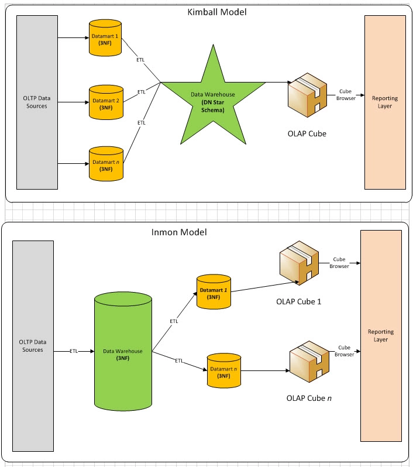
#### 2.2.3.2. 特性
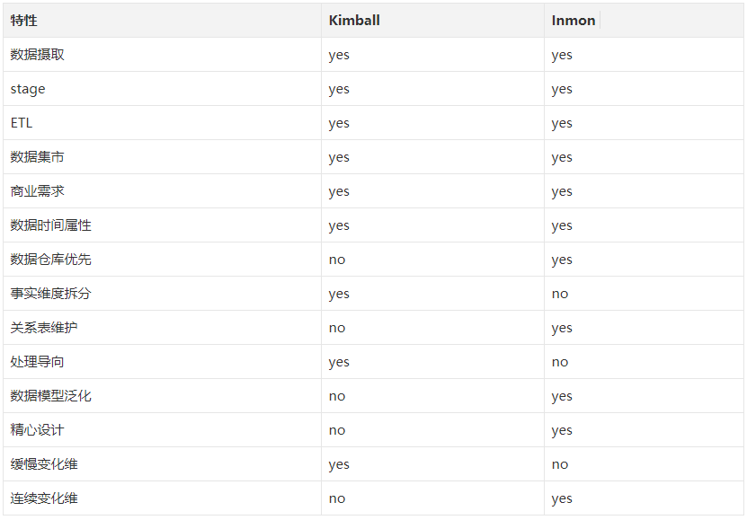
#### 2.2.3.3. 优劣比较
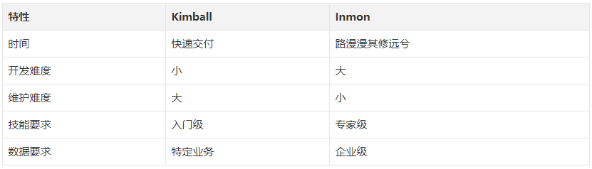
#### 2.2.3.4. 具体例子
##### 2.2.3.4.1. 数据
股票交易为例：
（OLTP）原始数据包含了如下几张事务表：(真实场景字段设计更为复杂，此处已经简化)
+ 交易记录表：记录用户下单情况  

+ 成交日志表：记录用户下单且成交的情况
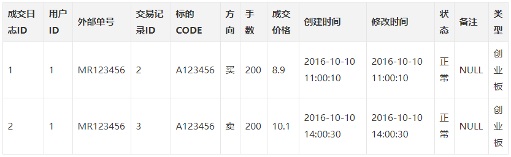
+ 用户信息表  
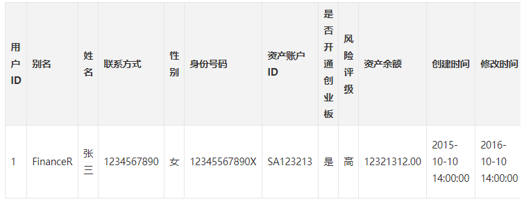
##### 2.2.3.4.2. 对比
如果是 Inmon 模式，我们需要将数据库拆分成 用户实体表、成交日志实体表、用户与成交日志关系表等多个子模块。
如果是 Kimball 模式，我们则需要将数据库拆分成 用户维度表、用户资产事实表、成交事实表。在Kimball模式中，我们不需要单独维护关系表，因为关系已经冗余在维度表和事实表中。
##### 2.2.3.4.3. Inmon 模式：
用户实体表
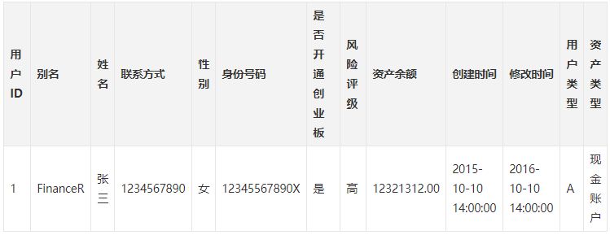
成交关系表
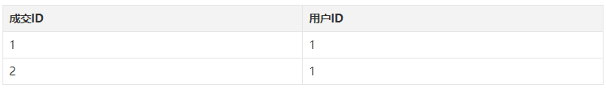
用户资产关系表
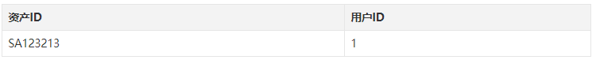
##### 2.2.3.4.4. Kimball 模式：
用户维度表
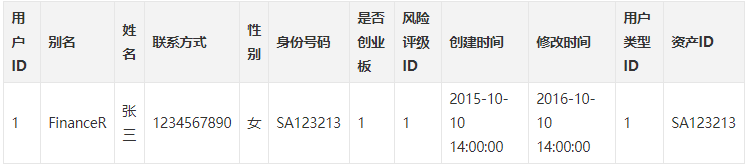
可以看到这里的用户维度表不包含业务交易信息，变化相对缓慢（静态）
而风险评级、用户类型也需要由风险评级维度表、用户类型维度表来维护

用户资产事实表
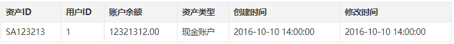
这里的用户资产事实表通常数据是由用户资产交易日志产生的，因为日志存在只插入，不更新的特点（快速增加、最细粒度）
##### 2.2.3.4.5. 总结
+ 对于大多数互联网公司由于需求的快速变化，处心积虑设计（Inmon）实体-关系的设计哲学似乎并不能满足快速迭代的业务需要。所以，更多场景下趋向于使用（Kimball）维度-事实的设计哲学反而可以更快地完成任务。  
+ 数据仓库建设通常以日为粒度，将OLTP数据变化的情况增量同步到数据仓库中。  
+ 在数据仓库的实际工作中，80%的时间会花费在任务调度、数据清洗和业务梳理上，只有20%的时间会投入到数据挖掘上。  
**这里需要额外说明，目前我们的数仓建设，是基于Inmon模式的**

**概念：雪花/星型模型**   
### 2.2.4. （可略过）新一代架构 OPDM 操作型数据集市 (仓库)
OPDM 大约是在 2011 年提出来的，严格上来说，OPDM 操作型数据集市（仓库）是实时数据仓库的一种，他更多的是面向操作型数据而非历史数据查询与分析。

### 2.2.5. 数据模型（概念模型、逻辑模型、物理模型）
在面对企业复杂业务与成千上万的数据项进行设计时，没有哪个牛逼的人都记得住的，所以出现了按照某种层次规则去有组织并抽象与管理易用，由此诞生了概念模型、逻辑模型、物理模型

### 2.2.6. 数据源差异（非互联网、互联网、移动互联网）

### 2.2.7. （了解）约 2010-2012 年的平台结构

### 2.2.8. （了解）约 2012-2013 年的平台结构

### 2.2.9. 事实表、维度举例
比如在淘宝订单付款事务事实表中，粒度为子订单，相关的维度有买家、卖家、商品、收货人信息、业务类型、订单时间等维度。
淘宝交易事务事实表
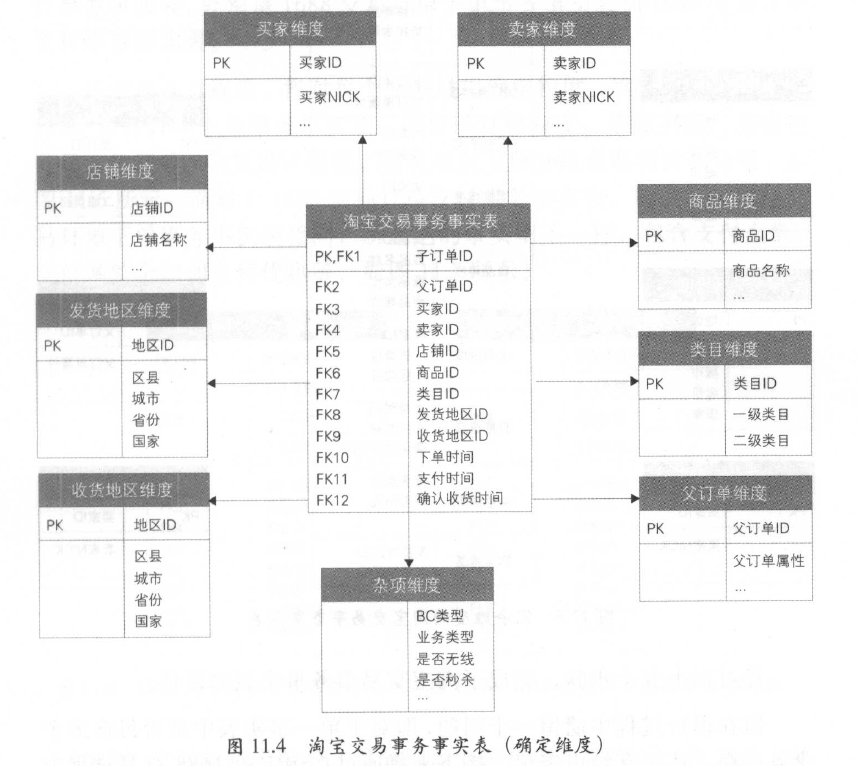
冗余维度的淘宝交易事务事实表
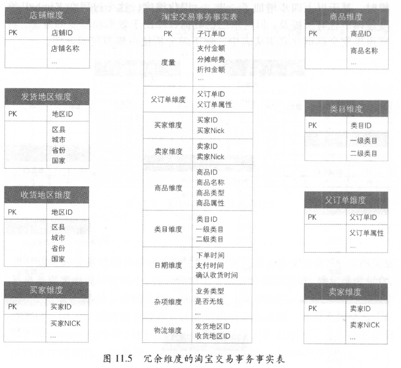
### 2.2.10. 雪花模型&星型模型
#### 2.2.10.1. 先举个例子，淘宝商品的雪花模型
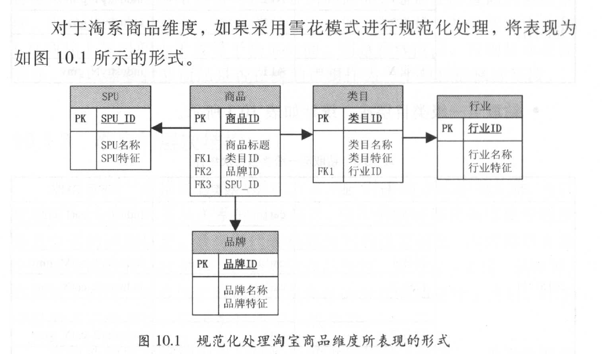
#### 2.2.10.2. 概述
在多维分析的商业智能解决方案中，根据事实表和维度表的关系，又可将常见的模型分为星型模型和雪花型模型。在设计逻辑型数据的模型的时候，就应考虑数据是按照星型模型还是雪花型模型进行组织。
##### 2.2.10.2.1. 销售数据仓库中的星型模型
当所有维表都直接连接到“ 事实表”上时，整个图解就像星星一样，故将该模型称为星型模型。
星型架构是一种非正规化的结构，多维数据集的每一个维度都直接与事实表相连接，不存在渐变维度，所以数据有一定的冗余，如在地域维度表中，存在国家 A 省 B 的城市 C 以及国家 A 省 B 的城市 D 两条记录，那么国家 A 和省 B 的信息分别存储了两次，即存在冗余。
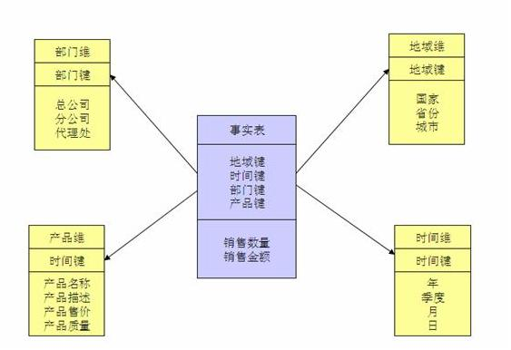
##### 2.2.10.2.2. 销售数据仓库中的雪花模型
当有一个或多个维表没有直接连接到事实表上，而是通过其他维表连接到事实表上时，其图解就像多个雪花连接在一起，故称雪花模型。雪花模型是对星型模型的扩展。它对星型模型的维表进一步层次化，原有的各维表可能被扩展为小的事实表，形成一些局部的 " 层次 " 区域，这些被分解的表都连接到主维度表而不是事实表。如图 2，将地域维表又分解为国家，省份，城市等维表。它的优点是 : 通过最大限度地减少数据存储量以及联合较小的维表来改善查询性能。雪花型结构去除了数据冗余。
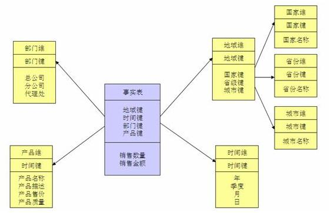
星型模型因为数据的冗余所以很多统计查询不需要做外部的连接，因此一般情况下效率比雪花型模型要高。星型结构不用考虑很多正规化的因素，设计与实现都比较简单。雪花型模型由于去除了冗余，有些统计就需要通过表的联接才能产生，所以效率不一定有星型模型高。正规化也是一种比较复杂的过程，相应的数据库结构设计、数据的 ETL、以及后期的维护都要复杂一些。因此在冗余可以接受的前提下，实际运用中星型模型使用更多，也更有效率。
#### 2.2.10.3. 使用选择
星形模型(Star Schema)和雪花模型(Snowflake Schema)是数据仓库中常用到的两种方式，而它们之间的对比要从四个角度来进行讨论。
+ 数据优化  
雪花模型使用的是规范化数据，也就是说数据在数据库内部是组织好的，以便消除冗余，因此它能够有效地减少数据量。通过引用完整性，其业务层级和维度都将存储在数据模型之中。
相比较而言，星形模型使用的是反规范化数据。在星形模型中，维度直接指的是事实表，业务层级不会通过维度之间的参照完整性来部署。
+ 业务模型
在雪花模型中，数据模型的业务层级是由一个不同维度表主键-外键的关系来代表的。而在星形模型中，所有必要的维度表在事实表中都只拥有外键。
+ 性能
第三个区别在于性能的不同。雪花模型在维度表、事实表之间的连接很多，因此性能方面会比较低。
而星形模型的连接就少的多。
+ ETL
雪花模型加载数据集市，因此ETL操作在设计上更加复杂，而且由于附属模型的限制，不能并行化。
星形模型加载维度表，不需要再维度之间添加附属模型，因此ETL就相对简单，而且可以实现高度的并行化。
+ 总结
雪花模型使得维度分析更加容易，比如“针对特定的广告主，有哪些客户或者公司是在线的?”星形模型用来做指标分析更适合，比如“给定的一个客户他们的收入是多少?”

# 3. 数仓技术实现
## 3.1. 元数据管理要义

## 3.2. 分层逻辑架构

## 3.3. 典型的数据仓库架构分层
数据仓库标准上可以分为四层：ODS（临时存储层）、PDW（数据仓库层）、DM（数据集市层）、APP（应用层）。
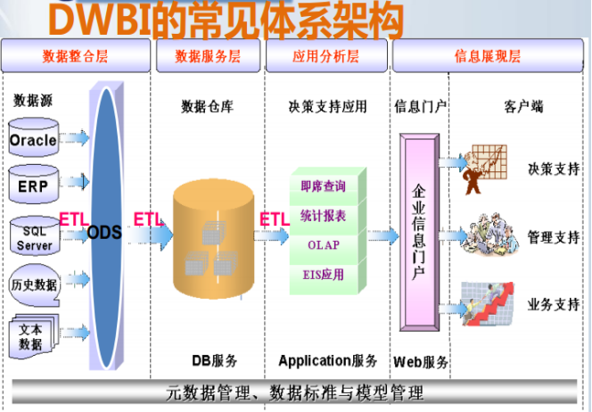
1）ODS层：
为临时存储层，是接口数据的临时存储区域，为后一步的数据处理做准备。一般来说ODS层的数据和源系统的数据是**同构**的，主要目的是简化后续数据加工处理的工作。从数据粒度上来说ODS层的数据粒度是最细的。ODS层的表通常包括两类，一个用于存储当前需要加载的数据，一个用于存储处理完后的历史数据。历史数据一般保存3-6个月后需要清除，以节省空间。但不同的项目要区别对待，如果源系统的数据量不大，可以保留更长的时间，甚至全量保存；
2）PDW层：（EDW）
为数据仓库层，PDW层的数据应该是一致的、准确的、干净的数据，即对源系统数据进行了清洗（去除了杂质）后的数据。这一层的数据一般是遵循数据库第三范式的，其数据粒度通常和ODS的粒度相同。在PDW层会保存BI系统中所有的历史数据，例如保存10年的数据。
3）DM层：
为数据集市层，这层数据是面向主题来组织数据的，通常是星形或雪花结构的数据。从数据粒度来说，这层的数据是轻度汇总级的数据，已经不存在明细数据了。从数据的时间跨度来说，通常是PDW层的一部分，主要的目的是为了满足用户分析的需求，而从分析的角度来说，用户通常只需要分析近几年（如近三年的数据）的即可。从数据的广度来说，仍然覆盖了所有业务数据。
4）APP层：
为应用层，这层数据是完全为了满足具体的分析需求而构建的数据，也是星形或雪花结构的数据。从数据粒度来说是高度汇总的数据。从数据的广度来说，则并不一定会覆盖所有业务数据，而是DM层数据的一个真子集，从某种意义上来说是DM层数据的一个重复。从极端情况来说，可以为每一张报表在APP层构建一个模型来支持，达到以空间换时间的目的。数据仓库的标准分层只是一个建议性质的标准，实际实施时需要根据实际情况确定数据仓库的分层，不同类型的数据也可能采取不同的分层方法。
## 3.4. 阿里数仓分层

## 3.5. 阿里模型架构图 （大数据之路9.3）
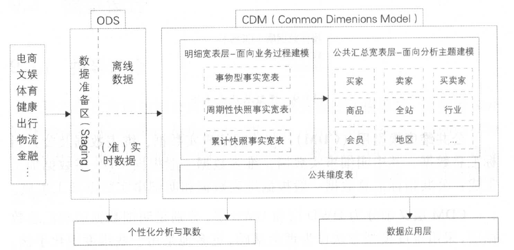

# 4. 数据管理篇
## 4.1. 元数据
### 4.1.1. 元数据定义
元数据主要记录数据仓库中模型的定义、各层级间的映射关系、监控数据仓库的数据状态及ETL 的任务运行状态。在数据仓库系统中，元数据可以帮助数据仓库管理员和开发人员非常方便地找到他们所关心的数据，用于指导其进行数据管理和开发工作，提高工作效率。
将元数据按用途的不同分为两类：技术元数据（ Technical Metadata)和业务元数据（ Bu siness Metadata ）。

### 4.1.2. 元数据价值
+ 找出超长运行节点
+ 在数据内容方面为集团数据进行数据域、数据主题、业务属性等的提取和分析提供数据素材。例如可以利用元数据构建知识图谱，给数据打标签，清楚地知道现在有哪些数据。
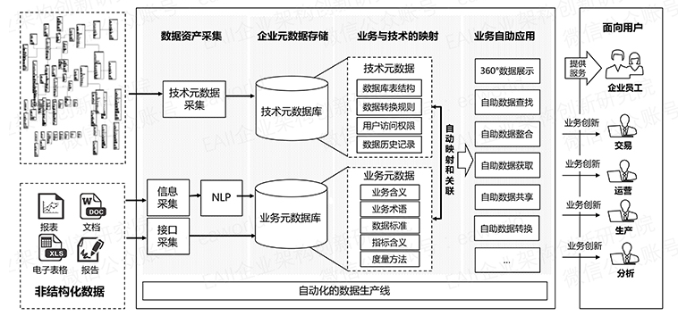

### 4.1.3. 统一元数据体系建设思路图
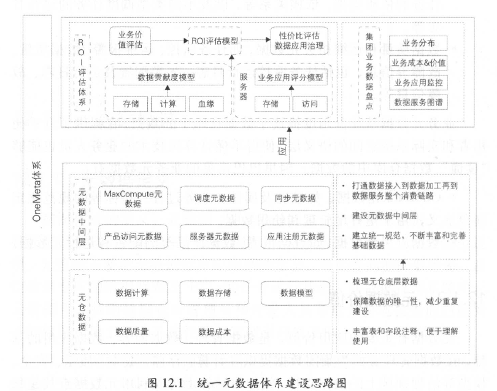

# 5. 工具
阿里DataX数据同步

# 6. 逻辑架构（从头开始再次梳理）
下图为典型的数仓架构
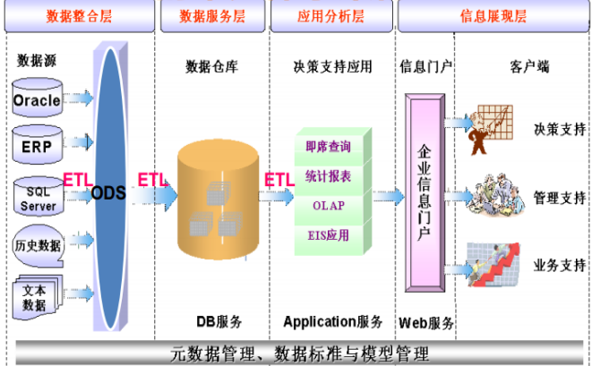

下图为阿里的数仓架构
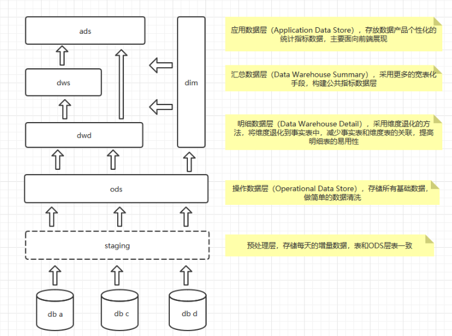
目前我司使用的数仓架构
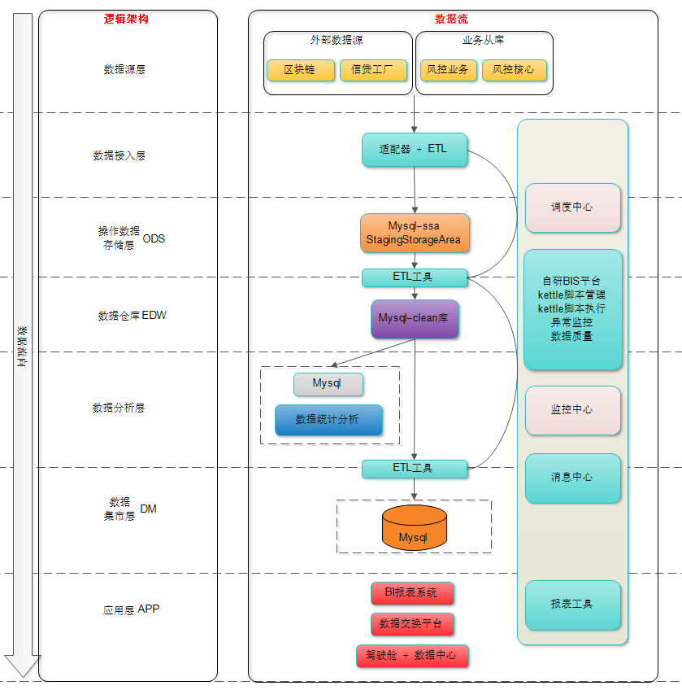

我们的架构说明：
+ 是Inmon还是Kimball架构？
Inmon 的 EDW 的原则是准三范式的设计、Ralph kilmbal 是星型结构。
所以我们是Inmon架构
+ 什么是星型/雪花模型？跟Inmon和Kimball的关系？
雪花模型使用的是规范化数据，也就是说数据在数据库内部是组织好的，以便消除冗余，因此它能够有效地减少数据量。通过引用完整性，其业务层级和维度都将存储在数据模型之中。
相比较而言，星形模型使用的是反规范化数据。在星形模型中，维度直接指的是事实表，业务层级不会通过维度之间的参照完整性来部署。
Inmon 的 EDW 的原则是准三范式的设计、Ralph kilmbal 是星型结构
+ 各层次的职责是什么？都有什么作用？
    + **数据源层**：是各个OLTP系统的从库，不允许从主库同步数据，否则可能会对主库产生性能影响
    + **数据接入层**：这一层，可以与**staging**层意义相同，staging的作用是存储每天的增量数据。为何要存储增量数据？好处是可以多次的执行下游的同步请求，而不需要每次都从OLTP的从库进行同步；如果不使用临时的数据存储，那么也可以直接使用ETL工具，将数据同步到ODS，ODS与OLTP库表是同构的，是3NF结构
    + **ODS层**：为临时存储层，是接口数据的临时存储区域，为后一步的数据处理做准备。一般来说ODS层的数据和源系统的数据是**同构**的，主要目的是简化后续数据加工处理的工作。从数据粒度上来说ODS层的数据粒度是最细的。ODS层的表通常包括两类，一个用于存储当前需要加载的数据，一个用于存储处理完后的历史数据。历史数据一般保存3-6个月后需要清除，以节省空间。但不同的项目要区别对待，如果源系统的数据量不大，可以保留更长的时间，甚至全量保存；**这一层，不做清洗转换工作**
    + **EDW层**：由于我们是Inmon架构，遵守3NF，不存在星型/雪花模型，所以不需要用到DWD,DWS等维度相关的处理过程；**进入到这一层的数据，需要做数据清洗、转换工作；同时，EDW中的数据，可以为商业智能/数据分析团队提供数据支持**
    + **DM数据集市层**：这层数据是面向主题来组织数据的，通常是星形或雪花结构的数据。从数据粒度来说，这层的数据是轻度汇总级的数据，已经不存在明细数据了。
+ 有没有做维度和事实表？
没有，即使是在DM数据集市，也没有采用星型/雪花模型，不存在维度
**提问：那么这样是否合理？**
+ 为何没有区分dwd和dws？
上面已经回答过，因为模型选择不同。
+ 现在都有哪些库，各叫什么名字？命名规范是什么？
raw_credit,clean,result；
