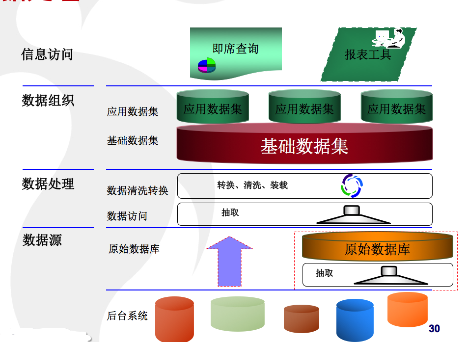

[toc]
# 数仓概念
概念的引入
+ 什么是数仓？
+ 数仓的几个特点是什么？
+ 什么是OLAP？什么是OLTP？区别是什么？
+ 拉链表是什么？怎么实现拉链表？
+ 同步又哪几种方式？
+ 为什么要做增量？怎么做增量？
+ 什么是ETL？

数仓概念这一章节内容，主要是摘抄现今约定俗称的、规范的定义或概念
具体的内容，可以参考网上的教程https://www.jianshu.com/p/da62fb0c6a0b，下面是节选和备注
## 说说数仓(1) - 什么是数仓
`数据仓库（DataWarehouse），一般缩写成DW、DWH。数据仓库是一个面向主题的（Subject Oriented）、集成的（Integrate）、相对稳定的（Non-Volatile）、反映历史变化（Time Variant）的数据集合，用于支持管理决策。`
&emsp;从字面上来看，数据仓库就是一个存放数据的仓库，它里面存放了各种各样的数据，而这些数据需要按照一些结构、规则来组织和存放。这里我们会遇到一个问题就是同样是存放数据的仓库，那数据库和数据仓库是一样的吗？
**数据库 VS 数据仓库**
数据库就是我们常用的关系型数据库（MySQL、Oracle、PostgreSQL...），还有什么非关系型数据库，它主要存放业务数据，那数据仓库又有些什么数据呢？
说到他们的区别，我们一般会提到OLTP和OLAP，
OLTP：on-line transaction processing，联机事务处理，主要是业务数据，需要考虑高并发、考虑事务
OLAP：On-Line Analytical Processing，联机分析处理，重点主要是面向分析，会产生大量的查询，一般很少涉及增删改

**大数据**
&emsp;数据仓库其实是一套体系，他不是一门什么技术，而是整合了很多已有的技术，来更好地组织和管理数据。
&emsp;传统数仓的话，主要是基于关系型数据库，后面还有一些分布式的数据库像Greenplum，还有很多公司会提供基于硬件的一整套解决方案。在传统数仓开发时，由于硬件的性能有限，所以有很多的要求，而随着硬件价格的下降、云服务器的广泛使用，还有大数据技术的成熟发展，数仓的很多场景都变了，有些规则都不需要去严格遵守了，这样也可以省下很多的成本。
**前世今生1**
&emsp;以前很多招聘ETL工程师的，这些岗位主要是基于某一个厂商的工具入手，熟练使用该工具就行了，比如Datastage，以前玩儿过一个报表工具叫Cognos，IBM的一个工具，当时写了很多文章，有几百篇，也有很多岗位是招Cognos工程师的，后来不玩儿这个。
&emsp;传统行业喜欢叫数仓，互联网公司喜欢叫数据平台（包含数仓，偏向建模）。我记得数仓这一概念也是从传统行业发起的，它涉及的资料其实都是好多年之前的了，最近也找过，但是没什么新的内容，概念还是那些概念，只是技术更新迭代了，所以也导致很多的观点不太适用了。
&emsp;就目前互联网数仓这一岗位，感觉更加偏重业务+建模思想，面试不太好考察这些内容的，去年招聘的时候，就是问些基本问题，聊聊以往主要的工作内容，还会问问SQL题，真的想了解下建模的话，还是找本书借鉴性的看看，还是很有益处的。

## 说说数仓(2) - 传统数仓与互联网数仓
**前世今生2**
本节内容，借鉴下面的几篇文章，建议直接看原文，本节内容只会摘抄部分关键要素
[我所经历的大数据平台发展史（一）：非互联网时代 • 上篇](https://www.infoq.cn/article/the-development-history-of-big-data-platform/)
[我所经历的大数据平台发展史（二）：非互联网时代 • 下篇](https://www.infoq.cn/article/the-development-history-of-big-data-platfor2-part01/)
[我所经历的大数据平台发展史（三）：互联网时代 • 上篇](https://www.infoq.cn/article/the-development-history-of-big-data-platform-paet02/)
[我所经历的大数据平台发展史（四）：互联网时代 • 下篇](https://www.infoq.cn/article/the-development-history-of-big-data-platform-internet-age/)

### 用户群体
+ 传统企业数据平台用户群

   + 企业的 boss、运营的需求主要是依赖于报表、商业智能团队的数据分析师去各种分析与挖掘探索；
   + 支撑这些人是 ETL 开发工程师、数据模型建模、数据架构师、报表设计人员 ，同时这些角色又是数据平台数据建设与使用方。
   + 数据平台的技术框架与工具实现主要有技术架构师、JAVA 开发等。
   + 用户面对是结构化生产系统数据源。
   **可以看出`传统企业数据平台用户群`的工作模式中，只有ETL开发工程师、模型架构师、研发架构师、程序员承担对`数据平台`的建设和使用**
+ 互联网数据平台用户群

   + 互联网企业中员工年龄比非互联网企业的要年轻、受教育程度、对计算机的焦虑程度明显比传统企业要低、还偶遇其它各方面的缘故，导致了数据平台**所面对用户群体与非互联网数据平台有所差异化**；
   + 互联网数据平台的使用与建设方是来自各方面的人，数据平台又是技术、数据产品推进建设的。
   + 分析师参与数据平台直接建设比重增加。
   + 原有的数据仓库开发与模型架构师的职能也从建设平台转为服务与咨询.
   + 用户面对是数据源多样化，比如日志、生产数据库的数据、视频、音频等非结构化数据 。
   **从上述的描述中可以看出：互联网数据平台用户群，ETL开发工程师、模型架构师不再直接对上游负责，而是转为培训、咨询、解决方案，这就要求业务分析师、数据PD、数据产品PD要能直接操作数据平台，而这就要求数据平台有足够的工具支撑**

**什么是PD？**
PD：直译为产品设计师，也可能叫产品规划师、需求分析师。PD侧重于将一个个杀手级应用做功能级的设计，在这个模块上，PD类似是一个小产品经理。
1、技术团队中的架构师（或者系统分析师，也可能叫项目经理、开发组长）会与PD紧密合作，这时候开始考虑技术可行性，性价比。
2、PD的职位描述：
（1）调查市场并研究需求，形成市场需求文档。
（2）负责新产品设计，拟定设计规划和方案。
（3）负责新产品的原型设计。
（4）组织产品开发团队，协调资源，跟进产品的开发，保证日程进度。
（5）分析产品运营数据，收集运营意见，及时调整产品形态，优化产品，并提出合理的运营建议。
（6） 以用户体验为中心，改进现有产品，或设计新产品。
### 数据平台时间发展史

+ 约在 1991 年前的全企业集成
+ 1991 年后的企业数据集成 EDW 时代
+ 1994 年 -1996 年的数据集市
+ 1996-1997 年左右的两个架构吵架
+ 1998 年 -2001 年左右的合并年代

**故事：**
&emsp;五个时代划分是以重要事件或代表人物为标志，比如说在企业数据集成 EDW 时代其重要代表人物是 Bill Inmon 代表作数据仓库一书，更重要是他提出了如何建设数据仓库的指导性意见与原则。他遵循的是自上而下的建设原则，这个导致后来数据仓库在千禧年传到中国后的几年内，几个大实施厂商都是遵守该原则的实施方法，后来的数据仓库之路等各种专业论坛上针对数据仓库 ODS-EDW 的结构讨论 (备注：坛子里有个叫吴君，他发表了不少这方面的文章)。
&emsp;在国内项目实施中 IBM、Terdata、埃森哲、菲奈特 (被东南收购，东南后来某些原因而倒闭) 等很多专业厂商在实施中对 ODS 层、EDW 层都赋予了各种不同的功能与含义 (备注：在后边的架构案例解)。
&emsp;在数据集市年代其代表人物是 Ralph kilmball，他的代表作是”The Data Warehouse Toolkit“，在数据仓库的建设上 Ralph kilmball 提出的是自下而上的建设方法，刚好与 Bill Innmon 的建设方法相反，这两种架构方式各有千秋，所以就进入了争吵时代。
&emsp;随着数据仓库的不断实践与迭代发展，从争吵期进入到了合并的时代，其实争吵的结果要麽一方妥协，要麽新的结论出现，果然 Bill inmon 与 Ralph kilmball 的争吵没有结论，干脆提出一种新的架构包含对方，也就是后来 Bill Inmon 提出的 CIF（corporation information factory） 架构模式、这也算是数据仓库的第三代架构，其架构特点是把整个架构划分为不同层次，把每一层次的定义与功能都详细的描述下来，从 04 年后国内的很多数据仓库架构、甚至互联网刚开始搞数据平台数据仓库架构模式也是这一种。
### 数据平台第一代架构（数据源 -> EDW -> 分析服务器出结果）没有多级的ETL
（开发时间 2001-2002 年）
海尔集团的一个 BI 项目，架构的 ETL 使用的是 微软的数据抽取加工工具 DTS

### 数据平台第二代架构（数据源 -> EDS -> DM -> 结果呈现）多级ETL
下面是上海通用汽车的一个数据平台，别看复杂，严格意义上来讲这是一套 EDW 的架构、在 EDS 数据仓库中采用的是准三范式的建模方式去构建的、大约涉及到十几种数据源，建模中按照某一条主线把数据都集成起来
这个数据仓库平台计划三年的时间构建完毕，第一阶段计划构建统统一生性周期视图、客户统一视图的数据，完成对数据质量的摸底与部分实施为业务分析与信息共享提供基础平台。第二阶段是完成主要业务数据集成与视图统一，初步实现企业绩效管理。第三阶段全面完善企业级数据仓库，实现核心业务的数据统一。

下面是国内某银行的一套数据集市，这是一个典型数据集市的架构模式、面向客户经理部门的考虑分析。

### 数据平台第三代架构 - 数据仓库混合性架构 (Cif)

这是太平洋保险的数据平台。
回过头来看该平台架构显然是一个混合型的数据仓库架构。它有混合数据仓库的经典结构，每一个层次功能定义的非常明确。
ODS（Operational Data Store） 层 支撑单一的客户视图，是一个偏操作行的做唯一客户识别的，同时提供高可用户性客户主信息查询。
EDW（Enterprise Data Warehouse） 层基于 IIW（IBM 的通用模型去整理与实施）最细粒度、原子、含历史的数据，也支持查询。
各业务数据集市 (DM-Data Mart) 面向详细业务，采用雪花 / 星型模型去做设计的支撑 OLAP、Report、仪表盘等数据展现方式。

# 数仓技术实现