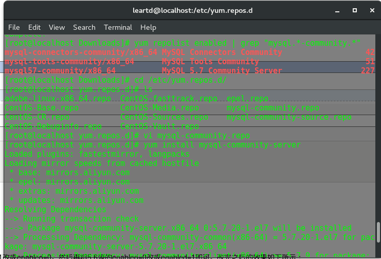
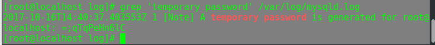

<!-- TOC -->

- [1. CentOS7 yum 安装与配置MySQL5.7](#1-centos7-yum-安装与配置mysql57)
    - [1.1. 配置YUM源](#11-配置yum源)
    - [1.2. 安装MySQL](#12-安装mysql)
    - [1.3. 启动MySQL服务](#13-启动mysql服务)
    - [1.4. 开机启动](#14-开机启动)
    - [1.5. 修改root本地登录密码](#15-修改root本地登录密码)
- [2. 使用docker安装mysql](#2-使用docker安装mysql)

<!-- /TOC -->

# 1. CentOS7 yum 安装与配置MySQL5.7
或参考：https://www.cnblogs.com/ianduin/p/7679239.html
## 1.1. 配置YUM源
+ 下载mysql源安装包
```
shell> wget http://dev.mysql.com/get/mysql57-community-release-el7-8.noarch.rpm
```
+ 安装mysql源
```
shell> yum localinstall mysql57-community-release-el7-8.noarch.rpm
```
+ 检查mysql源是否安装成功
```
shell> yum repolist enabled | grep "mysql.*-community.*"
```
看到下图所示表示安装成功。 

## 1.2. 安装MySQL
```
shell> yum install mysql-community-server
```
## 1.3. 启动MySQL服务
```
shell> systemctl start mysqld
```
## 1.4. 开机启动
```
shell> systemctl enable mysqld
shell> systemctl daemon-reload
```
## 1.5. 修改root本地登录密码
mysql安装完成之后，在/var/log/mysqld.log文件中给root生成了一个默认密码。通过下面的方式找到root默认密码，然后登录mysql进行修改：
```
shell> grep 'temporary password' /var/log/mysqld.log
```

```
shell> mysql -u root -p
mysql> ALTER USER 'root'@'localhost' IDENTIFIED BY 'MyNewPass4!'; 
```

# 2. 使用docker安装mysql
docker run --name mysql_for_wiki -p 3306:3306 -e MYSQL_ROOT_PASSWORD=123456 -d docker.io/mysql
docker exec -it d6 mysql -uroot -p
GRANT ALL PRIVILEGES ON *.* TO root@"%" IDENTIFIED BY "123456";